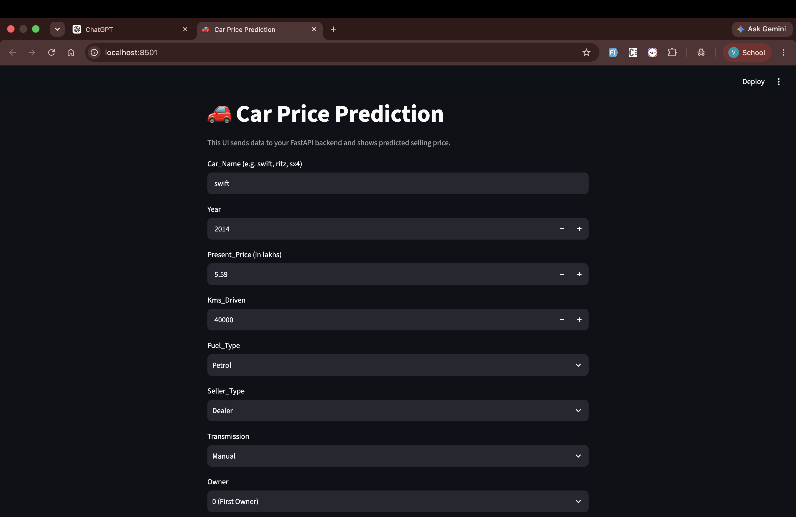

# Car Price Prediction



A machine-learning application that estimates a used car's selling price in **lakhs of Indian rupees**. It uses a trained Random Forest model behind a FastAPI prediction API, with an optional Streamlit interface.

## Features

- Predict selling prices from vehicle and listing details.
- FastAPI endpoint with automatic interactive documentation.
- Streamlit form for submitting predictions in a browser.
- Retraining script that saves the trained model and its feature columns.

## Project structure

```text
model/car-price-api/
├── main.py                  # FastAPI application
├── schema.py                # Request and response models
├── model.py                 # Model loading and input preprocessing
├── train.py                 # Random Forest training script
├── streamlit_app.py         # Streamlit user interface
├── cardekho_data (1).csv    # Training dataset
├── random_forest_model.pkl  # Trained model artifact
├── feature_columns.pkl      # Feature columns used at inference
└── requirements.txt         # Python dependencies
```

## Prerequisites

- Python 3.10 or later
- `pip`

## Installation

From the repository root:

```bash
cd model/car-price-api
python -m venv .venv
source .venv/bin/activate
pip install -r requirements.txt
```

On Windows, activate the environment with:

```powershell
.venv\Scripts\Activate.ps1
```

## Run the API

```bash
cd model/car-price-api
source .venv/bin/activate
uvicorn main:app --reload
```

The API starts at `http://127.0.0.1:8000`.

| Endpoint | Method | Description |
| --- | --- | --- |
| `/` | `GET` | Basic API status response |
| `/predict` | `POST` | Predict a car's selling price |
| `/docs` | `GET` | Interactive Swagger API documentation |

## Make a prediction

Send a `POST` request to `/predict`:

```bash
curl -X POST http://127.0.0.1:8000/predict \
  -H 'Content-Type: application/json' \
  -d '{
    "Car_Name": "ritz",
    "Year": 2014,
    "Present_Price": 5.59,
    "Kms_Driven": 27000,
    "Fuel_Type": "Petrol",
    "Seller_Type": "Dealer",
    "Transmission": "Manual",
    "Owner": 0
  }'
```

Example response:

```json
{
  "prediction_price": 3.42
}
```

### Input fields

| Field | Type | Description |
| --- | --- | --- |
| `Car_Name` | string | Car model/name, such as `ritz` or `swift` |
| `Year` | integer | Manufacturing year |
| `Present_Price` | number | Current showroom price in lakhs |
| `Kms_Driven` | integer | Total kilometres driven |
| `Fuel_Type` | string | `Petrol`, `Diesel`, or `CNG` |
| `Seller_Type` | string | `Dealer` or `Individual` |
| `Transmission` | string | `Manual` or `Automatic` |
| `Owner` | integer | Previous-owner count (`0` to `3`) |

## Run the Streamlit interface

Start the FastAPI application first. Then, in a second terminal:

```bash
cd model/car-price-api
source .venv/bin/activate
streamlit run streamlit_app.py
```

The UI opens in your browser. For local development, set `API_URL` in `streamlit_app.py` to:

```python
API_URL = "http://127.0.0.1:8000/predict"
```

The UI should read the API's `prediction_price` response field.

## Retrain the model

The training script reads the included CarDekho dataset, one-hot encodes categorical fields, trains a `RandomForestRegressor`, and saves the model artifacts.

Run it from the `model` directory so its relative paths resolve correctly:

```bash
cd model
python car-price-api/train.py
```

This updates:

- `model/car-price-api/random_forest_model.pkl`
- `model/car-price-api/feature_columns.pkl`

## Tech stack

- Python
- FastAPI and Uvicorn
- Streamlit
- pandas and scikit-learn
- joblib
